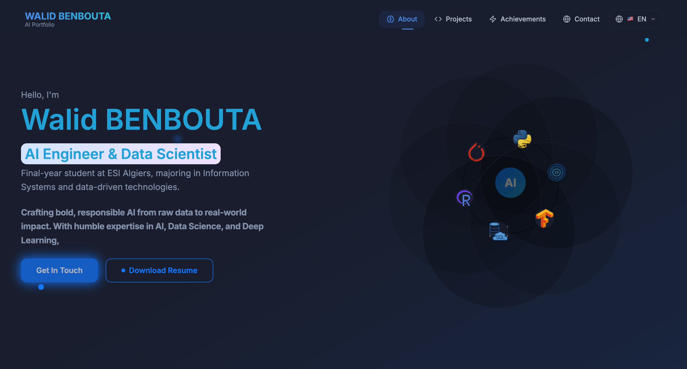

# Walid Benbouta - AI / ML Portfolio

Personal portfolio of **Walid Benbouta**, an AI and Data Science student focused on machine learning, deep learning, data engineering, NLP and applied research.

The portfolio presents selected projects, technical case studies, competition work and research-oriented experiments through an interactive React interface.

## Overview

This website is designed to help recruiters, collaborators and technical teams quickly explore:

- AI, machine learning and data engineering projects
- Technical methodologies, model results and implementation details
- Research work involving generative AI, NLP and graph data
- Competition achievements and professional skills
- Project reports, notebooks, CVs and supporting documents

## Stack

- React 18
- TypeScript
- Vite
- React Router
- Tailwind CSS
- shadcn/ui and Radix UI
- Framer Motion and Motion
- Recharts
- KaTeX for mathematical notation
- Vercel Analytics

## Architecture

The application is a client-side single-page application:

```text
src/
├── App.tsx                 # Providers and application routes
├── pages/
│   ├── Index.tsx           # Portfolio homepage
│   ├── ProjectDetail.tsx   # Dynamic project pages
│   └── projects/           # Project case studies
├── components/             # Navigation, sections and reusable UI
├── contexts/               # Shared application context
├── hooks/                  # Reusable React hooks
├── lib/                    # Constants and project metadata
└── translations/           # Multilingual content

public/                     # Images, reports, notebooks and downloadable documents
```

The homepage is composed of the navigation, hero, about, projects, achievements, contact and footer sections. Project pages are loaded lazily through React Router to keep the initial bundle focused.

## Featured Projects

The portfolio currently includes detailed pages for:

- **Daily Meal Forecast Engine** - machine learning for cafeteria demand forecasting
- **Multimodal Market Forecasting** - financial prediction using market data and news sentiment
- **Chess GAN** - constrained tactical puzzle generation with neural and symbolic validation
- **Renewable Energy Analytics** - data collection, clustering and interactive visualization
- **Web Scraping Platform** - browser automation and scalable data extraction concepts
- **GPT Code Tracing** - research-oriented code understanding and execution tracing
- **Protein Subcellular Localization** - applied machine learning for protein analysis
- **PFAS Tracking** - knowledge graphs and environmental contamination analysis

## Screenshots



## Demo

The production URL can be added here once the Vercel deployment domain is finalized:

**Live demo:** `https://your-domain.example`

For a local preview, follow the installation steps below.

## Installation

### Prerequisites

- Node.js 18 or later
- npm

### Run locally

```bash
git clone https://github.com/nirdidev05/electric-coder-pulse.git
cd electric-coder-pulse
npm install
npm run dev
```

The development server is then available at `http://localhost:5173`.

### Production build

```bash
npm run build
npm run preview
```

### Quality checks

```bash
npm run lint
```

## Deployment

The project is a static Vite application and can be deployed on Vercel with the following settings:

| Setting | Value |
| --- | --- |
| Framework preset | Vite |
| Build command | `npm run build` |
| Output directory | `dist` |
| Install command | `npm install` |

Connect the GitHub repository to Vercel to enable automatic deployments from the `main` branch.

## Contact

- GitHub: [nirdidev05](https://github.com/nirdidev05)
- LinkedIn: [Walid Benbouta](https://www.linkedin.com/in/benbouta-walid-416870291/)

## License

The source code is published for portfolio and educational purposes. Project reports, research material and third-party assets may have their own terms of use.
